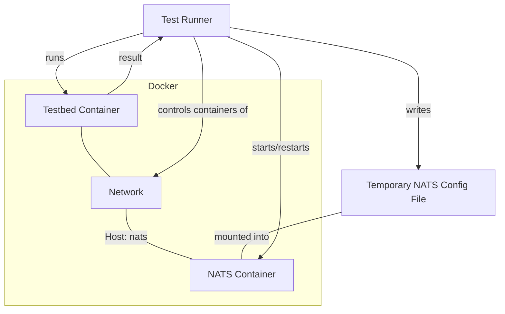
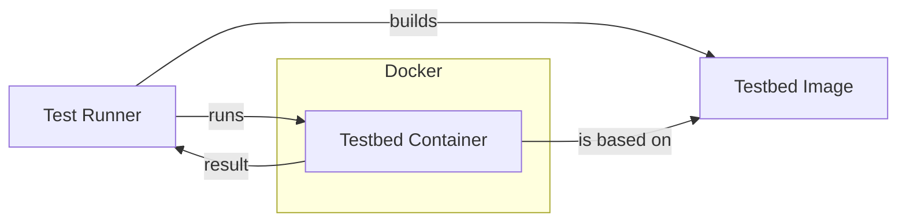

# Service Behavior Specification

Telestion services can be written in any language that supports the NATS protocol.

While there can be differences in the implementation, there are some things that all Telestion services should have in
common. This includes, among other things, the configuration of services, allowing seamless deployment of services
written in different languages.

## Gherkin

To specify these common behaviors, we use [Gherkin](https://cucumber.io/docs/gherkin/). Gherkin is a language that is
used to specify the behavior of software in a human-readable way while still being executable, meaning that tests can be
automated.

They are based on examples and should be written in a way that is independent of the implementation language.

The Gherkin files are located in the `backend-features` directory of the Telestion project.

## Documentation

The Gherkin files get converted to Markdown files that are then included in the documentation.

## Testing

### Architecture





### Natively

Create the Python virtual environment with the helper script:

```shell
./tools/setup-venv.sh
```

Source the virtual environment:

```shell
. .venv/bin/activate
```

Run the tests with:

```shell
./run-tests.py ./sample-service
```

> [!NOTE]
> You can also run the tests from any other directory.

> [!NOTE]
> Run `./run-tests.py --help` for more options, such as verbose output.
