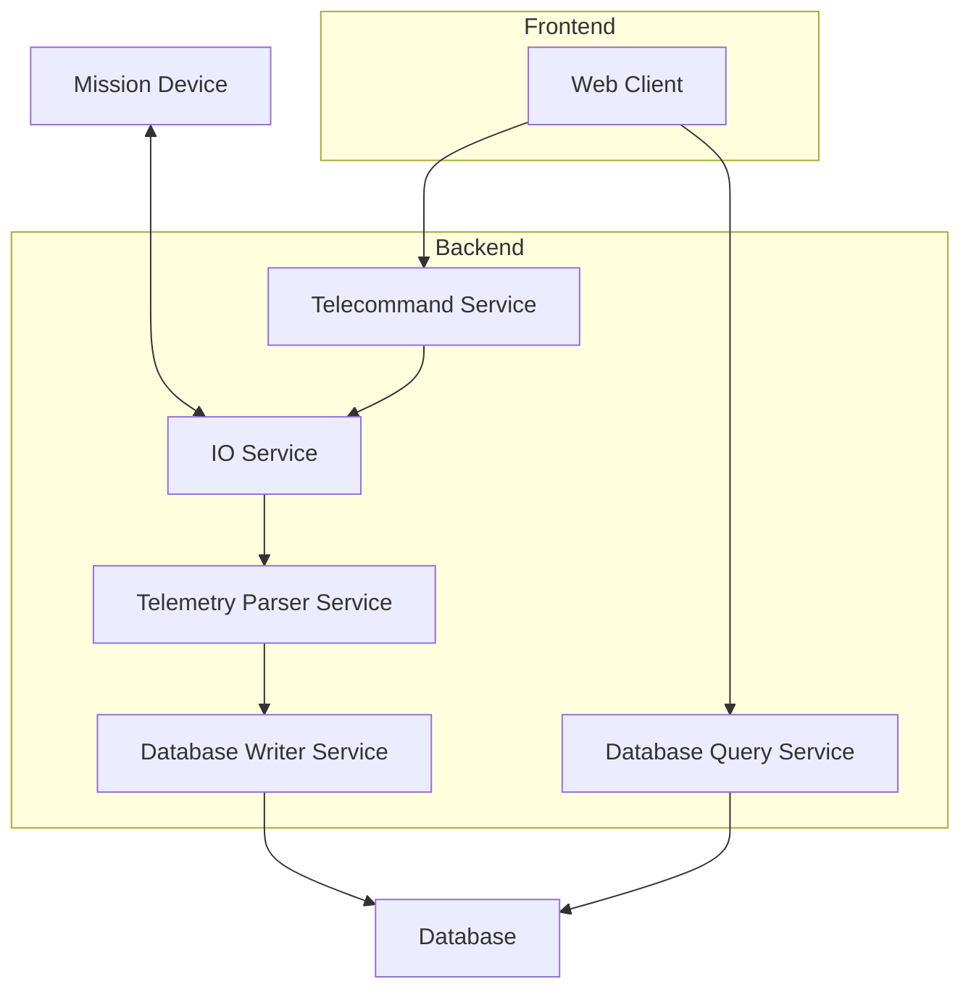

# Developing Backend Services

Backend services are small, self-contained, and (ideally) stateless applications that can be deployed and scaled independently. They are designed to be used in conjunction with other services and are often packaged together to form a larger application.

## Example Structure

The following is an example for the combination of services creating the backend of a Telestion application:

??? note "Text Description"
	1. The Mission Device sends telemetry data to the IO Service.
	2. The IO Service (backend) forwards the telemetry data to the Telemetry Parser Service.
	3. The Telemetry Parser Service (backend) parses the telemetry data and writes it to the database via the Database Writer Service.
	4. The Database Writer Service (backend) writes the telemetry data to the database.
	5. The Web Client (frontend) queries the database via the Database Query Service.
	6. The Database Query Service (backend) queries the database and returns the data to the Web Client.
	7. The Web Client (frontend) sends telecommands to the Telecommand Service. 
	8. The Telecommand Service forwards the telecommands to the IO Service.
	9. The IO Service sends the telecommands to the Mission Device.

## Getting Started

The most common way to write a backend service is to use TypeScript.

[Get started writing a backend service in TypeScript](typescript/index.md){ .md-button } 

However, for some use cases, it may be necessary to write a backend service in other languages.

Even some of the core services provided out of the box are written in Rust. To learn how to write a service in Rust, see [Using Rust](rust/index.md).

You can even write a backend service in any language you want. The only requirement is that it can communicate with the NATS message bus. To learn how to write a service in other languages, see [Using other languages](other-languages.md).
