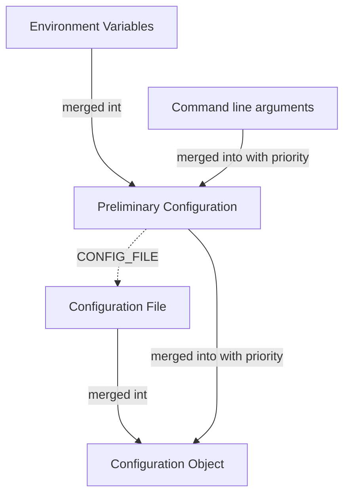

---
 tags:
   - Backend
   - TypeScript
---

# Service Configuration

!!! tip
    Not every service needs to be configurable. If you are writing a simple service, you can skip this section.

    However, you can often save yourself a lot of time by making your service configurable. This way, you can use the same service in multiple environments without having to change the code.

## Configuration Sources

Services can be configured using the following sources:

- Environment variables
- Command line arguments
- An optional configuration file (JSON)

All these sources get combined into a single configuration object. If a configuration value is defined in multiple sources, the following order is used:

1. Command line arguments
2. Environment variables
3. Configuration file

### Environment Variables

Environment variables are the most common way to configure a service. They are easy to use and supported by most platforms.

Environment variables are always strings. If you need to use a different type, you will have to parse the value yourself.

### Command Line Arguments

Command line arguments are useful for configuring a service during development. They are also useful for overriding configuration values when running a service in production.

### Configuration File

Configuration files are useful for configuring a service in production. They are also useful for overriding configuration values when running a service in production.

Configuration files are optional. If no configuration file is provided, the service will still start.

A configuration file is a JSON file with an object as its root element. The keys of this object are the configuration values. The values of this object are the configuration values.

The configuration file is loaded from the path passed as `CONFIG_FILE` as either environment variable or command line argument.

You can optionally also pass a `CONFIG_KEY` to load a specific key from the configuration file. This is useful if you want to use the same configuration file for multiple services.

### Configuration Precedence Overview Diagram

<figure markdown>

<figcaption markdown>
Configuration sources and their order of precedence.
</figcaption>
</figure>

??? note "Text Description"
    1. Environment variables are merged into the preliminary configuration.
    2. Command line arguments are merged into the preliminary configuration with priority.
    3. The configuration file is loaded (based on the `CONFIG_FILE` parameter of the preliminary configuration) and merged into the preliminary configuration.
    4. The preliminary configuration is merged into the configuration object with priority.
    5. The configuration object gets returned.

## Minimal Configuration Values

Some configuration values are required for all services. These values are:

* `NATS_URL`: The URL of the NATS server to connect to.
* `NATS_USER` (if the NATS server requires authentication): The username to use when connecting to NATS.
* `NATS_PASSWORD` (if the NATS user requires authentication): The password to use when connecting to NATS.
* `SERVICE_NAME`: The name of the service. This is used to identify the service in the logs and in the NATS server. This is required for all services.
* `DATA_DIR`: The directory where the service can store data. This is required for all services.

!!! tip
    To make it easier to run your service during development, sensible defaults are used when you pass the `--dev` flag to the service:

    | Configuration Value | Default Value |
    | ------------------- | ------------- |
    | `NATS_URL`          | `localhost:4222` |
    | `NATS_USER`         | (none) |
    | `NATS_PASSWORD`     | (none) |
    | `SERVICE_NAME`      | `dev-[process gid]` |
    | `DATA_DIR`          | `./data` |

    This way, you don't have to set all the required configuration values when running the service locally.
    
    Without the `--dev` flag, the service fails if any of the required configuration values are missing.

## Accessing the Configuration

Now that you know about the different configuration sources, let's see how you can access the configuration in your service. Since the complicated bits are handled by the `startService` function, this is actually pretty straight forward.

Create a file called `config.json` next to your `service.ts` file with the following content:

```json title="config.json"
{
  "SERVICE_NAME": "Config Tester",
  "tasks": {
    "task1": "Task 1",
    "task2": "Task 2"
  }
}
```

Now, let's adjust the `service.ts` file to use the configuration:

```typescript title="service.ts"
import { startService } from "jsr:@wuespace/telestion";
import { z } from "https://deno.land/x/zod@v3.21.4/mod.ts";// (1)!

const { config: rawConfig/* (2)! */} = await startService({
  nats: false,
});

const config = z.object({
  NAME: z.string(),
  tasks: z.record(z.string(), z.string()),
}).parse(rawConfig);// (3)!

console.log(config.NAME, config.tasks);// (4)!
```

1. Import the `z` function from the Zod to validate the configuration. Never assume the configuration is valid. Always validate it before using it.
2. Save the raw configuration in a variable called `rawConfig`.
3. Validate the configuration using Zod. This will throw an error if the configuration is invalid.
4. You can now safely use the configuration in your service. If the configuration is invalid, the service will not start.

Now, let's see what happens if we run the service:

```shell
deno run --allow-all service.ts --dev
```

As expected, the service doesn't start:

```shell
$ deno run --allow-all service.ts --dev
Running in development mode.
Using default values for missing environment variables.
error: Uncaught ZodError: [
  {
    "code": "invalid_type",
    "expected": "string",
    "received": "undefined",
    "path": [
      "NAME"
    ],
    "message": "Required"
  },
  {
    "code": "invalid_type",
    "expected": "object",
    "received": "undefined",
    "path": [
      "tasks"
    ],
    "message": "Required"
  }
]
```

Let's fix this by passing the required configuration values:

```shell
deno run --allow-all service.ts --dev \
  --CONFIG_FILE ./config.json \ # (1)!
  --NAME "Hello" # (2)!
```

1. Pass the path to the configuration file using the `--CONFIG_FILE` flag.
2. Pass the `NAME` configuration value using the `--NAME` flag.

Now, everything works as expected.
