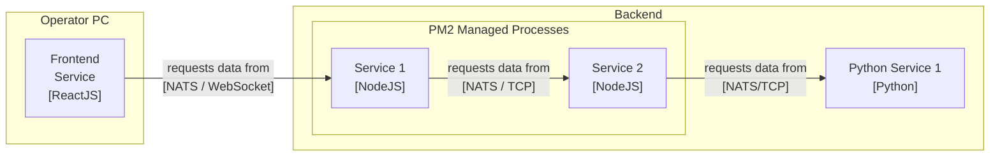

# ADR-0004: Revised Vert.x-independent terminology

Date: 2023-01-18

## Status

Accepted

## Context

<!-- The issue that is motivating this decision and any context that influences or constrains the decision. -->

The original terminology of the Telestion project was based on Vert.x' EventBus, which was a good starting point but has become less relevant as the project has evolved. With the decision to use NATS as the distributed message bus for the project (as documented in [ADR-0003](.//0003-use-nats-as-distributed-message-bus.md)), it became clear that the terminology needed to be revised to be more independent of specific technologies.

One particular issue with the old terminology was the ambiguity in the client/server terminology. A Verticle could be both a client to other Verticles and a server for other Verticles, which was confusing and made it harder to understand the system architecture. With NATS, the only "server" is the NATS server itself, while the NATS client libraries are only clients to the NATS server (even when used on a server-side microservice).

Moreover, as Telestion has evolved, it has become clear that microservices can be implemented in other languages and frameworks besides Java/Vert.x. Therefore, the term "Verticle" is no longer appropriate to describe a microservice and should be considered an implementation detail instead.

To address these issues, we need to revise the terminology of the project to be more consistent, clear, and independent of specific technologies. This will help to ensure that the terminology accurately reflects the system architecture and is easier to understand for all stakeholders, including developers, users, and managers.

## Decision
<!-- The change that we're proposing or have agreed to implement. -->

We will modify the terminology used to refer to different components in the system based on the feedback received:

1. We will refer to the NATS server as the *message broker*, *message bus*, or *NATS server* interchangeably.
2. We will call any component that acts as a service, including those with or without an attached user interface, a *service*. The collection of all services that do not have an immediate user interface will be referred to as the *backend* or *backend services*.
3. We will call any component that provides a user interface, which were formerly called "clients," a *frontend*. In most cases, the frontend will authenticate to the message broker as the user using it, while any backend service acts on behalf of itself.

These changes aim to provide a more precise and consistent naming convention that takes into account the fact that some components may have both service and frontend functionalities. It also addresses the concern that calling the frontend a "client" could be misleading.

For example, an application could include components like the ones depicted below. The components communicate with each other via the NATS message broker.

> Since the message broker is always used and there is at least conceptually only a single message broker, we can exclude it from the diagram to improve its readability. Note that although the message broker can be clustered to achieve higher availability, this is conceptually treated as a single message broker instance, as it is still a singleton per application, but not necessarily per machine.

## Consequences
<!-- What becomes easier, or more difficult to do and any risks introduced by the change that will need to be mitigated? -->

The new terminology is more consistent and less ambiguous. It is also more generic and independent of Vert.x and NATS:

- The terminology is now independent of Vert.x and can be used for other frameworks and languages as well.
- The terminology is now independent of the message bus implementation and can be used for other message buses as well.
- The terminology is now independent of the deployment environment and can be used for other deployment environments as well.
- The terminology is now independent of the user interface and can be used for other user interfaces as well.
- The terminology is now independent of the programming language and can be used for other programming languages as well.

After accepting this ADR, we should update the documentation and the code to use the new terminology.

## References

- [ADR-0003](./0003-use-nats-as-distributed-message-bus.md)

