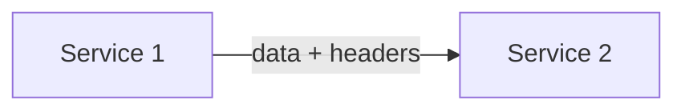
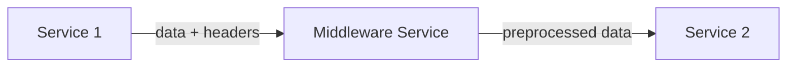

# ADR-0006: NATS message format

Date: 2023-01-24

## Status

Accepted

Amends [ADR-0003: Use NATS as distributed message bus](0003-use-nats-as-distributed-message-bus.md)

## Context
<!-- The issue that is motivating this decision and any context that influences or constrains the decision. -->

NATS messages are, at their core, just byte arrays that [need to be re-interpreted if needed](https://docs.nats.io/using-nats/developer/receiving/structure). It is therefore up to Telestion to decide if we want to have additional recommendations and/or requirements for messages sent via the message bus in Telestion applications.

Based on the experience from the *RocketSound* and *Daedalus 2* projects, there are two prominent most needed types of data processed in a Telestion application:

- structured data (for example, in a JSON format)
- binary data (for complex data, raw Telemetry / Telecommands, file contents, etc.)

The NATS documentation explicitly [mentions JSON](https://docs.nats.io/using-nats/developer/receiving/structure) as an example for structured data and [includes JSON support in many of its libraries](https://github.com/nats-io/nats.deno/blob/cefcd4cee9108708fbaed9a0cf7860fdfdc1f0d3/nats-base-client/codec.ts#L56) (including, but not limited to, for TypeScript).

Microservices are the most modular / work the best when they don't need to know about origin or destination of their messages (as such a requirement would "distract" from the single responsibility pattern).

## Decision
<!-- The change that we're proposing or have agreed to implement. -->

We will use (and recommend the usage of) a **UTF-8 encoded JSON** string as payload format for structured data.

We will consider any message (including structured data) to have an **unknown type until it is explicitly validated by the service receiving the message**. We will not assume the existence of any properties / the type of any JSON-based message until it's fully validated (for example, in TypeScript, through the usage of a [library like `zod`](https://github.com/colinhacks/zod)).

We will use (and recommend the usage of) the **raw binary data** (without any additional encoding) as `Int8Array` for binary / non-structured data.

We will allow the usage of **headers only as additional metadata** (for example, the time that the message was received), but consider the existence of headers to be optional (any services must be able to process any message that they could process with headers just as well without headers). We will include any information that affects the control flow of messages in either the [hierarchical subject](https://docs.nats.io/nats-concepts/subjects#subject-hierarchies) or the payload, but not the headers.

## Consequences
<!-- What becomes easier, or more difficult to do and any risks introduced by the change that will need to be mitigated? -->

- for structured data, we are compatible with NATS' `JSONCodec` (which exists in their own TypeScript library) and follow [their documentation's example](https://docs.nats.io/using-nats/developer/receiving/structure) of using JSON.

- we will have no overhead and great support of binary message formats.

- we will potentially have some overhead due to using UTF-8 instead of ASCII. This should, however, be minimal, since it only affects the "Extended ASCII codes" ($\geq 128$), the usage of which is not expected to outweigh the usage of characters $\geq 256$, which would cause significant overhead with ASCII-based formatting (requiring constructs like `\u00df`, i.e., at least 6 Bytes of character data). Thus, we don't expect any actual overhead by using UTF-8 over ASCII.

- we will have to differentiate well between structured and binary messages.

- by not considering headers to be an integral part of a message, we can simply "plug" another service between two other services in their communication as a kind of middleware without having to care about forwarding any headers (cf. *Headers Example*)
  

### Headers example

If `Service 2` can handle this,

is can also handle this (and thus requires no knowledge of the data's origin):

