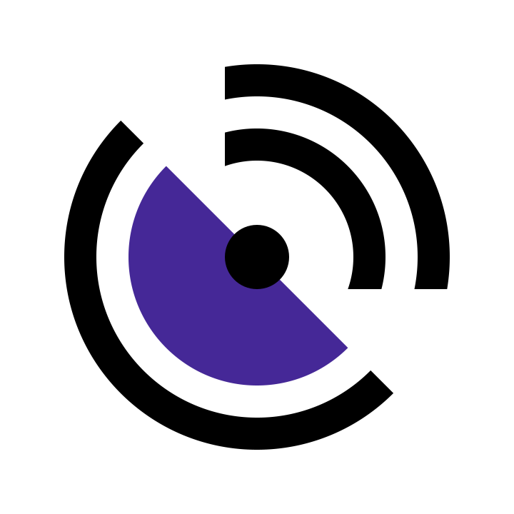

# Telestion Developer Documentation

{align=left width=150px}

Telestion is a framework for building telemetry applications. You can find more information about the project on the [project website](https://telestion.wuespace.de/).

This documentation is about developing a Ground Station software using Telestion. For end-user documentation, please ask your Telestion developer.

[Get started](getting-started.md){ .md-button }

## Quick links

### GitHub repositories

* [:simple-github: Telestion](https://github.com/wuespace/telestion) -- The main repository for the Telestion project
* [:simple-github: Telestion Architecture](https://github.com/wuespace/telestion-architecture) -- The repository that hosts the ADRs (Architecture Decision Records) for the Telestion project

### Related projects

* [NATS](https://nats.io/) -- The message bus used by Telestion
* [TypeScript](https://www.typescriptlang.org/) -- The programming language used for most components by Telestion
* [Deno](https://deno.com/) -- The runtime used by Telestion for TypeScript and JavaScript based services
* [React](https://reactjs.org/) -- The frontend framework used by Telestion

## Discord

The Telestion Discord server is the best place to interact with the Telestion community. You can ask questions, get help, and discuss the project with other users and developers.

[:simple-discord: Join the Discord server](https://discord.gg/Uw7tEWcWve){ .md-button }
