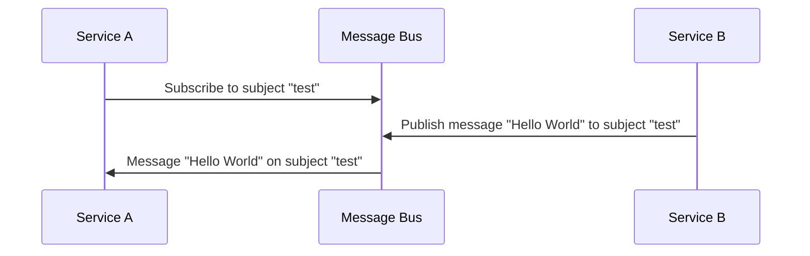
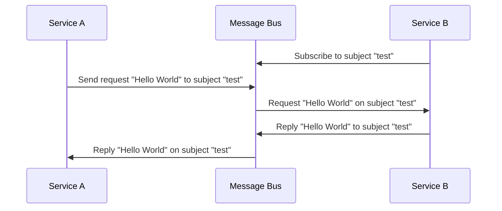

# Message Bus

The message bus is a simple, lightweight, and fast way to send messages between different parts (_services_) of your application. It's a publish/subscribe system that allows you to send messages to a specific subject and have any listeners on that subject receive the message.

## Messages

Messages are the way that data is sent between services. In the Telestion ecosystem. Messages are either [JSON](https://www.json.org/json-en.html) or binary data.

## Subjects

Subjects are the way that messages are sent between services. Each subject has a name. The name is used to identify the subject.

## Publish / Subscribe

The message bus is a publish/subscribe system. This means that you can publish messages to a specific subject and have any listeners on that subject receive the message.

!!! warning
	**Messages aren't stored when using the publish/subscribe method.** This means that if a service isn't listening on a subject when a message gets published, it won't receive the message.
	
	If you need to ensure that a message is received, you can use the [Request / Reply](#request-reply) system to await confirmation.

### Example

Here is an example of how the publish/subscribe system works:

??? note "Text Description"
	1. Service A subscribes to the subject "test" on the message bus
	2. Service B publishes the message "Hello World" to the subject "test"
	3. The message bus sends the message "Hello World" to Service A

## Request / Reply

The message bus is also a request/reply system. This means that you can send a request to a specific subject and have any listeners on that subject reply to the request.

### Example

Here is an example of how the request/reply system works:

??? note "Text Description"
	1. Service B subscribes to the subject "test" on the message bus
	2. Service A sends the request "Hello World" to the subject "test"
	3. The message bus sends the request "Hello World" to Service B
	4. Service B replies to the request with "Hello World"
	5. The message bus sends the reply "Hello World" to Service A

## NATS

We use [NATS](https://nats.io/) as our message bus.
While all other [services](service.md) can be replaced, the message bus is a core component of Telestion. It is the backbone of the entire system.

### Authentication and Authorization

NATS also handles everything related to authentication and authorization for the message bus. You can easily control who can send and receive messages on which subjects.
