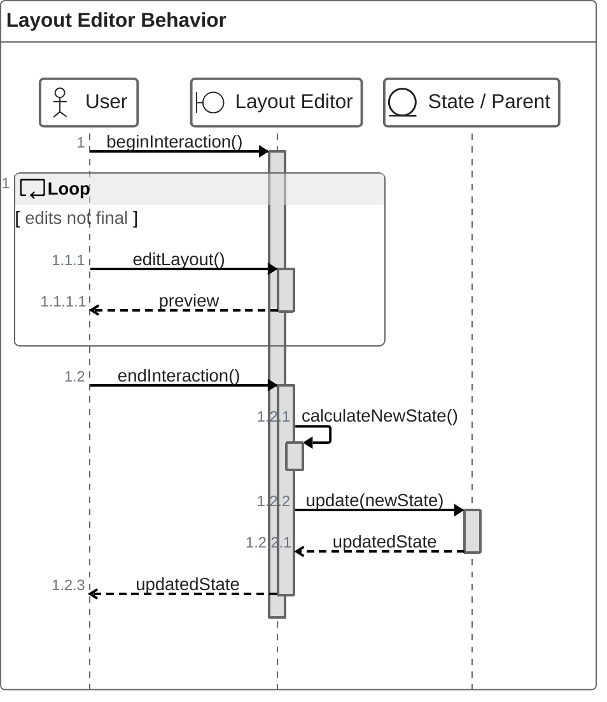

# Layout Editor

Date: 2024-01-14

Designed by:

- [Zuri Klaschka](https://github.com/pklaschka)

The layout editor for dashboards.

## Interface Definition

You can find the props passed into `LayoutEditor` in
the [`model/layout-editor-props.ts`](./model/layout-editor-props.ts) file.

Note that apart from the current `value: LayoutEditorState`, all props are optional.

However, they are required for various functions, like editing the layout, creating new widget instances, etc.

## Behavior

Note that the state is not updated until the user ends the interaction.

There are therefore two very distinct phases during an interaction:

1. the preview phase where any changes are visualized in real-time to the user.
2. the commit phase where the changes are interpolated to the closest applicable change (rounded to full grid cell
   units, etc.), and actually applied to the state.

This means that the application to the state can be performed without any regard to the actual user interaction, and
written and tested independently.

## State Management

The state is considered to be immutable. Updates to the state are performed using pure functions that return the new
state based on the previous state and the new data.

## User Interaction

User interaction can be performed using both the mouse and the keyboard.

## Changes

n/a
